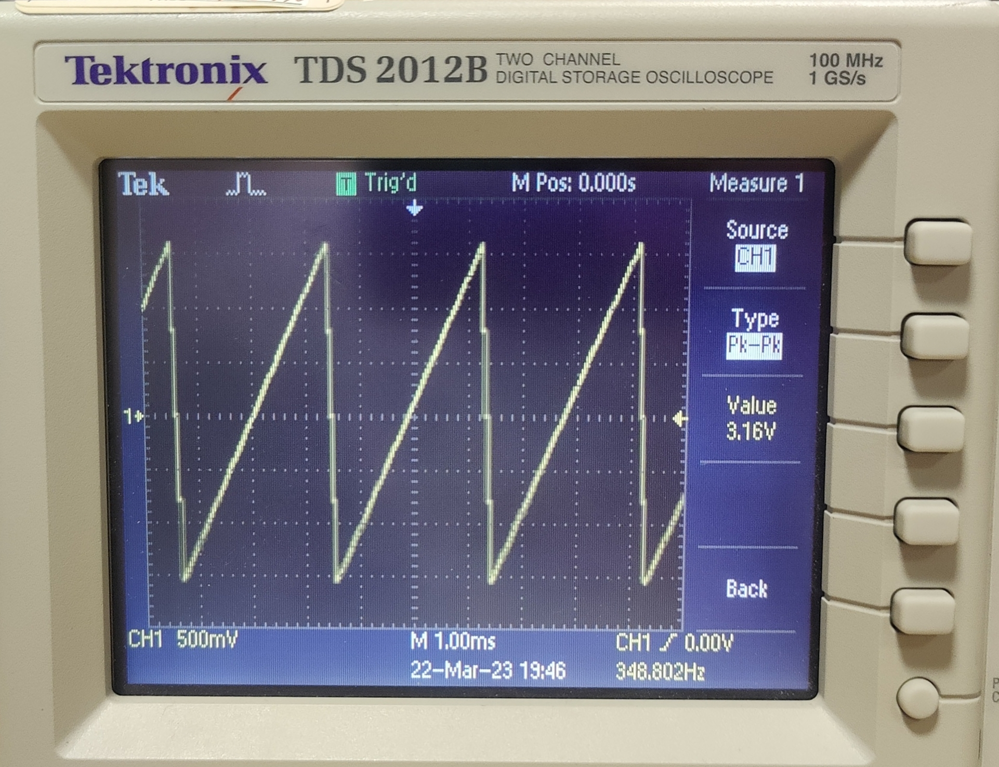
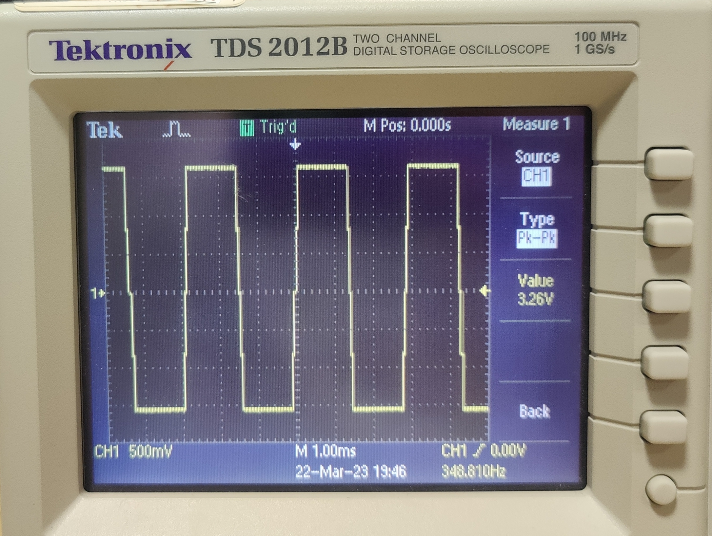
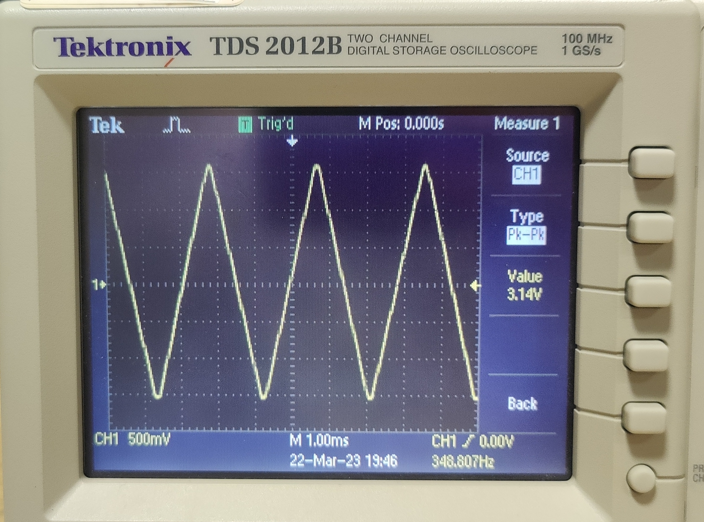
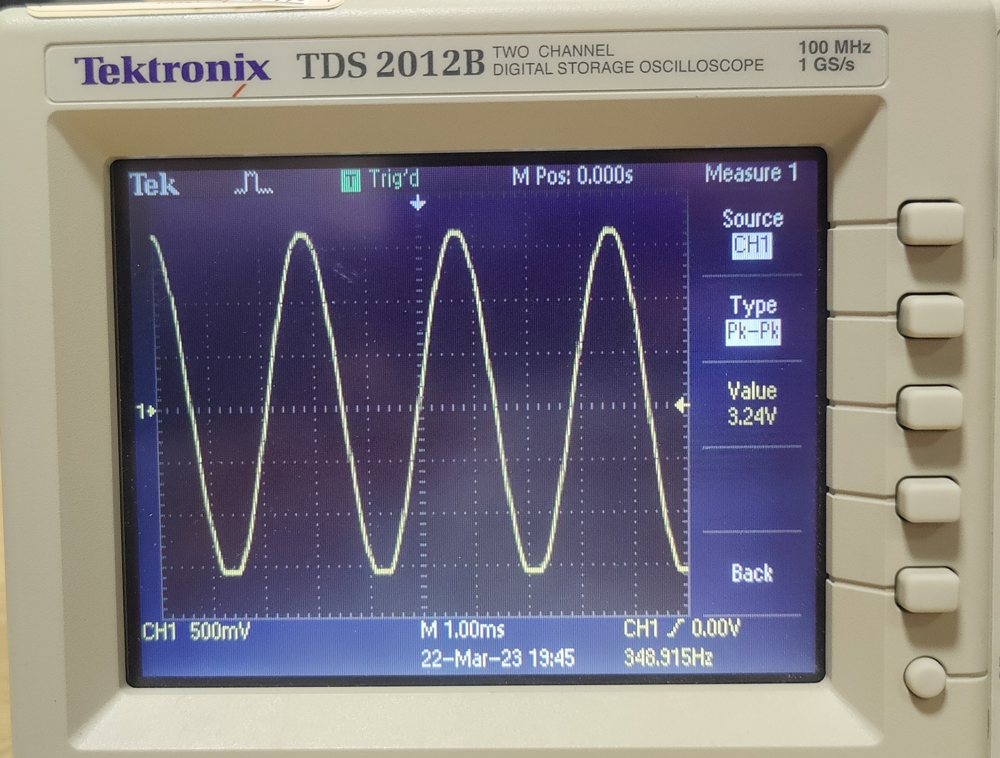

# Embedded Systems CW2, Synthesiser
## Introduction

This project explores real time programming through the development of a music synthesiser (keyboard). Base functionality was developed using the labs and afterward advanced features were added. All development aimed to improve the functionality of the synthesiser as a consumer device.

###### Knobs
    1. Knob0 - FM Frequency Control
    2. Knob1 - AM Frequency Control
    3. Knob2 - Octave Control
    4. Knob3 - Volume Control
###### Joystick
    5. Up/Down - Toggle AM/FM/Dual LFO
       Left/Right - Waveform Selection
###### Display
    6. Current Note
    7. Current Volume
    8. Current Octave
    9. Current Waveform
    10. LFO State
    11. LFO Frequency (If Toggled)

## Sections

- [Base Features](#base-features)
- [Advanced features](#advanced-features)
- [Critical timing analysis](#critical-timing-analysis)

## Base Features
All base features described in the labs and specification have been implemented. In order to take advantage of concurrency, tasks have been implemented. The tasks are described in the following sections.

- [Scan Keys Task](#scan-keys-task)
- [Display Update Task](#display-update-task)
- [The Knob Class](#the-knob-class)
- [The CAN Bus](#the-can-bus)

### Sawtooth wave
The sawtooth wave is generated by using a phase accumulaters value, since the sawtooth wave is proportional to phase. 

### Volume control
Volume control is implemented through accessing the knob value of a specific knob. The value can range from 0 to 8. 

### Scan keys task
This task iteratively scans through all the rows of the KeyArray to find which 'keys' are being pressed. Following this, the relevant variables are assigned in order to take action in other tasks/threads such as sound generation, display updates, and keyboard control. Access to the key matrix is protected by a mutex. 

### Display Update Task
The Display Update Task takes care of the GUI. It is needed in order to make the device usable by a regular consumer with minimal instructions rather than a datasheet. This task uses information from global variables and hence is dependent on other tasks such as the Scan keys task. As a result, the initiation interval is longer than the tasks it is dependent on. Additionally, this task has a low priority and longer initiation interval as the user experience is not improved by a faster update rate.
<!-- The display update function is made to enhance user experience and to make it more usable for first-time users. Its purpose is to update the screen to help users understand what they are doing with the device. The function displays a large amount of data for the user to be in tune with what is happening. It shows them the octave they are playing on (which is controlled by the second knob), the volume (third knob) and the wave type which is being played (first knob). It also shows the user the note they are playing to facilitate their learning and playing if they have limited experience with the instrument. The function works like the ScanKeys function with a task scheduler; however, since the frequency, it is called is lower than the Scankeys function, it has a lower priority in the scheduling process. -->

### The Knob Class
The Knob Class enables declaration of knob objects which consists of the necessary parameters and methods to retrieve the current ‘value’ of the given knob.

Each knob is decoded every time the key matrix is scanned, therefore updated in scanKeys task. As the knobs are rotated and generate the quadrature signal, the value of rotation is decoded by calling the knob value retrieval method, comparing the current state of the knob which is read from the key matrix with the previous state. The amount/direction of rotation is found by interpreting the state changes. When knob objects are being updated, they must be protected by a mutex such that they are not being accessed by other tasks at the same time. 

The knob value (a parameter of the class instance) is incremented or decremented depending on the state change, and is bounded by the upper or lower limits of the knob, specified by the developer. Additionally, in effort to improve accuracy of knob decoding when rotation is quick, or the key matrix isn’t scanned quickly enough to detect transient states, there are cases in decoding to interpret the impossible state transition. This is done by keeping track of previous increments and assuming the impossible transition was in the same direction as the last legal transition. 

### The CAN Bus
To communicate with other keyboard modules, the master or receiver board initiates a handshake message on startup using the CAN bus. The CAN Bus is used to transfer information between the master board and the auxillary slave boards. Queues are implemented to ensure that CAN bus messages are not missed, since the hardware buffer can only store 3 messages. Queues also allow for sending and receiving to be done at momentarily inconsistent rates. This means that tasks only need to interact with the queues, and not the CAN bus directly, which allows for robust behaviour.
## Advanced Features
- [Auto Detection using Handshake](#auto-detection-using-handshake)
- [Double Buffer](#double-buffer) 
- [Stereo sound](#stereo-sound)
- [Joystick](#joystick)
- [Filtering](#filtering)
- [Low-Frequency Oscillation (LFO)](#low-frequency-oscillation)
- [Waveform selection](#waveform-selection)
- [Polyphony](#polyphony) 

### Auto Detection using Handshake
An auto handshake detection is implemented which, on startup, correctly interprets lower, middle and upper octave modules for a two or three keyboard set-up. Futher keyboards were not implemented since we didn't have enough boards to test with. The implementation is described below.

The master board initiates a handshaking sequence on startup. It sets its eastern handshaking signal to false, and transmits a handshaking message on the CAN Bus. All boards are decoding messages from the CAN Bus regularly. If a message received contains the handshake ID in its ID field, boards that decode this message will set a global boolean flag to true under the protection of a mutex. This flag is checked during the handshaking task. This then decouples the handshaking task and the CANdecode tasks. This is done because the handshaking task does not require a high frequency of execution whereas the CANdecode task does. Hence, if their operation were coupled, the handshaking code would be executed at a high frequency, which is unnecessary and would decrease performance. The handshaking task checks the boolean flag, and its westernly handshake signal to determine whether to increment its position or not. The position variable of each board (stored as a global 8 bit unsigned integer) is used for decoding the CAN messages into the various octaves. Key presses sent from position 1 (the far left position and the master board) are set as the lower octave, whereas presses from position 2 (the middle position) is set as the middle octave, and presses from position 3 (the far right position) is set as the upper octave. 

Handshake messages contain the necessary information to distinguish a handshake message from a regular note message over the CAN bus. Once handshaking is complete, further handshake messages are not sent to avoid filling the message queue with unnecessary messages. Furthermore, these handshake message payloads contain information on previous module ‘positions’, so that the current module decoding its position is assigned the next correct value.

### Double Buffer and SampleBufferTask
Previously, the decoding of the keyArray and the RX_Message was done within the sampleISR. This meant that the sampleISR latency was very long. This is a problem since it's initiation interval is very short. In order to circumvent this, a separate task was developed that fills an array or 'buffer' with the correct voltages to play. This means that the sampleISR can be executed much faster since it has far less instructions. 

In order to do this, a double buffer was used, this follows the implementation described in the lab. This implementation is best paired with a DMA. The DMA was investigated but ultimately not implemented due to time constraints. 

Using this implementation, the sampleISR does no computation and just reads values from an array. This means that its latency is proportional to the AMAT (Average-Memory-Access-Time).

### Stereo sound
The master board collates information about the state of all keyboards. Immediately afterward, with the 'stereo' message ID, this information is distributed to all keyboards. The information is split between 2 packets due to the size. The other keyboards receive this information and create the corresponding sound using the sampleBufferTask and sampleISR.

### Joystick
The Joystick output pins output analog signals. This means that decoding the joystick into a quantized set of output requires thresholding.

The following steps are done separately for both horiziontal and vertical directions. 

A joystick task reads the joystick pins, storing the current and previous values for both horizontal and vertical directions. It then compares the readings against certain thresholds to determine if the joystick is 'active' or not. An active state is one where the joystick is far from the neutral position by a designer-specified threshold. If the joystick is 'active' and the current reading differs from the previous reading by a value larger than a different designer-specified threshold, a global joystick variable is incremented/decremented. The joystick is then used to control which waveform is playing and whether the waveform is being modulated by FM LFO, AM LFO or both. The initiation interval of the joystick task determines how fast one must move the joystick to register a reading. A slower initiation interval means that joystick readings are less frequent, and hence movement does not need to be large for the criterion to pass and the joystick variable to be incremented / decremented. 

### Filtering
The sound outputted by the keyboard was always quite synthetic and electronic, especially with the Sawtooth wave, which is not common in real musical instruments. To make the sound more realistic, we included an FIR filter on the output. The FIR filter attenuates certain frequencies to make the sound more precise and controlled. The FIR filter is only applied on the output wave to smooth it.

Filtering was done to pre-process the signal being written to the speaker so that the effect of noise in the signal was reduced. This has a noticable effect in the sound produced, improving the smoothness of the sound. Multiple filters were investigated, including a gaussian filter, a weighted average filter, and a moving average filter with balanced weights. Of these, various kernel sizes were also investigated. 

Gaussian and weighted average kernels required multiplying each element in the signal FIFO buffer with a either a floating-point coefficient or a large integer coefficient that would later be scaled down. This is an expensive operation, and hence reduces performance. Additionally, when the filter coefficients are different for each element in the signal FIFO buffer, the elements in the filter must be shifted down each time a new element is added to the buffer. This is also an expensive operation, and hence further reduces performance.

The output using the various filters was tested with an ossiloscope, and based upon viewing the waveform, it was decided that the difference between the output of a gaussian kernel and a balanced moving average filter was minimal. Hence, the balanced moving average filter was chosen as it has a far less expensive computation cost. This is because no shifting of elements is required since all coefficients are the same. Additionally, the implementation is cheap because instead of having fractional coefficients and multiplying, one can simply sum the FIFO buffer entries and divide the output. Furthermore, the FIFO design was such that the FIFO length was a power of 2, meaning that to output the filtered result, one only needs to right-shift the sum.

### Low-Frequency Oscillation

Low-Frequency Oscillation was added to the system to create different sound effects for the Music Synthesizer. The two effects in our device are the Tremolo and the Vibrato effects. They modify the output sound by either modulating the frequency or the amplitude of the output signal. The modulation is done by multiplying either the output volume or the step size being incrementing the phase accumulator by a $5$Hz Sine wave, hence LFO. To achieve the volume modulation, the Sine wave was kept between 0 and 1 as those values seemed the most reasonable for modulating sound since they help create a wobble effect. However, for the frequency modulation, the deviation was kept small (+- 1/1000th of the base signal) to produce a subtle vibrato effect given the rate of signal compression and rarefaction.

The LFO’s frequency is designed to be selected by the user as a choice of 3 values: 5Hz, 10Hz and 15Hz. The user can enable no LFO, AM LFO, FM LFO or both by using moving the joystick vertically. The user can modify the LFO frequencies by rotating knobs 1 and 2 on the keyboard.

The oscillation is done within the sample buffer task.

### Waveform selection
The synthesiser is capable of using four different waveforms: Sawtooth, Triangle, Square, and Sine. This can be dynamically changed by the user during runtime, the GUI reflects the current waveform at all times.

Below are descriptions of how the waveforms is generated:

##### Sawtooth wave

The sawtooth wave is implemented as described in the lab. V_out is proportional to the phase accumulator right shifted into the correct range. When this overflows it causes the discontinuity and thus the Sawtooth wave.

##### Square wave

The square wave is defined as f(x) = 1 for half the period and f(x) = -1 for the other half. To efficiently implement this definition, an int8_t is assigned to the phase accumulator right shifted 24 times. This effectively takes the top 8 bits of the phase accumulator, subtracts 128 from it and casts it into a signed number. The V_out is then assigned to be maximum or minimum depending on whether the new variable is greater than 0. This is correct behaviour since the new period is defined as from -128 -> 127, this being the range of an int8_t.

##### Triangle wave

For the triangle wave, the same methodology is applied but instead of changing the V_out to be maximum or minimum. The output is defined as f(x) = x +128 for x < 0 and x-128 for x >=0.

##### Sine wave

For the sine wave, a LUT based implementation is needed. This lookup table was generated by sampling a sine function. The number of samples needs to satisfy the Nyquist constraints. This is calculated using n = f_s / f where f_s is the sampling rate (defined by Nyquist constraints) and f is the frequency of the note being pressed. The number of samples is maximal when f is minimal, this is the lowest note and the lowest octave, roughly 22Hz. This leaves the number of samples as 22KHz / 22Hz = 1000. To take advantage of quick fixed point divisions via shifting, this is set to 1024. The phase accumulator is then right shifted by 10 in order to index the sine LUT which produces an output between -128 and 127.

### Polyphony

Polyphony is the ability to play notes simultaneously. Beforehand, if two notes were played, the board would only emit the sound of the last note played, which is unrealistic for any modern music synthesiser. Therefore polyphony was added to enable the user to play chords and enable them to generate more complex and intricate sounds. 

The software will look for keys pressed across all keyboards and sum them before writing to the DAC. In order to make sure that the
sound is not distorted, the sum of the notes is divided by the number of notes being played. This is done by keeping track of the number of notes being played in the sample buffer task. The number of notes being played is incremented when a note is pressed and decremented when a note is released. The number of notes being played is then used to divide the sum of the notes.

## Critical timing analysis 
